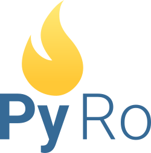

   
  

PyRo or Python Robot, is a MicroPython progam that host a website which can be used to control a simple robot. It is based on the Espriff range of boards, current development is being done on an ESP32.

### Powered by:

The virtual joystick that is used on PyRo is [virtualjoystick.js](https://github.com/jeromeetienne/virtualjoystick.js)  
The entire platform running on [MicroPython](https://github.com/micropython/micropython)  
The webserver is built on [PicoWeb](https://github.com/pfalcon/picoweb)  

   

